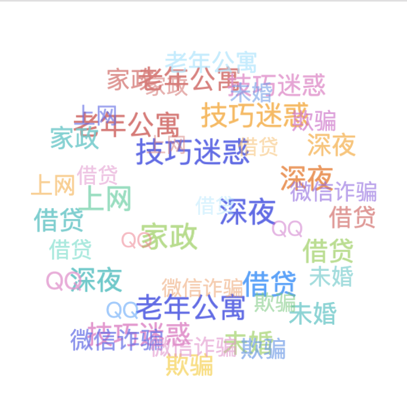

# js-tag-cloud

js 标签云

```js
npm install js-tag-cloud
```

```js
import JsTagCloud from 'js-tag-cloud'
let renderArr = ['深夜', '技巧迷惑', '老年公寓', '家政', '上网', '借贷', 'QQ', '微信诈骗', '欺骗', '未婚', '借贷', '深夜', '技巧迷惑', '老年公寓', '家政', '上网', '借贷', 'QQ', '微信诈骗', '欺骗', '未婚', '借贷', '深夜', '技巧迷惑', '老年公寓', '家政', '上网', '借贷', 'QQ', '微信诈骗', '欺骗', '未婚', '借贷', '深夜', '技巧迷惑', '老年公寓', '家政', '上网', '借贷', 'QQ', '微信诈骗', '欺骗', '未婚', '借贷']
const options = {
  radius: 170, // 滚动半径, 单位px
  maxSpeed: 'normal', // 滚动最大速度, 取值: slow, normal(默认), fast
  initSpeed: 'normal', // 滚动初速度, 取值: slow, normal(默认), fast
  direction: -135, // 初始滚动方向, 取值角度(顺时针deg): 0 对应 top, 90 对应 left, 135 对应 right-bottom(默认)...
  keep: false // 鼠标移出组件后是否继续随鼠标滚动, 取值: false, true(默认) 对应 减速至初速度滚动, 随鼠标滚动
}
JsTagCloud('#app', renderArr, options)
```


